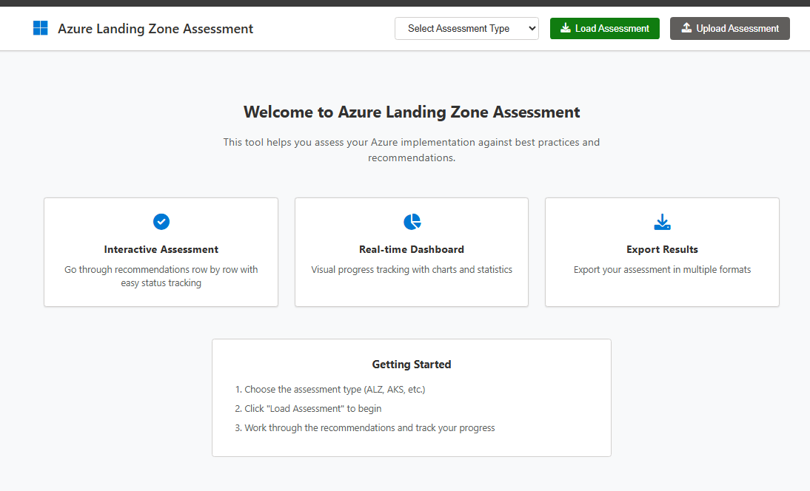
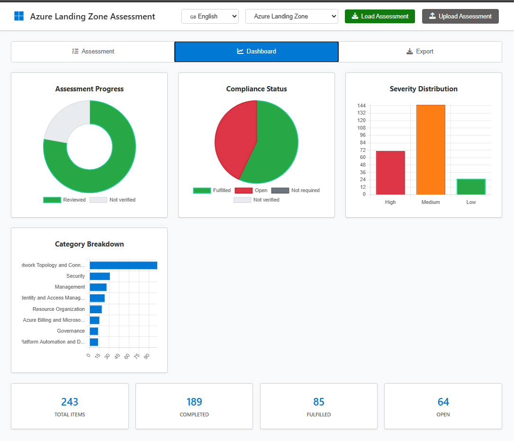

# ☁️ 🏗️ ALZ Assessment Tool

> **Interactive Azure Landing Zone Assessment Tool with Automated Checklist Updates**


A comprehensive web-based assessment tool that helps organizations evaluate their Azure implementations against Microsoft's best practices and recommendations. Features automated monthly updates directly from the official Azure review checklists repository.

🎥 **[Watch Demo Video](https://www.youtube.com/watch?v=bqEBs0mMkyo)** - See the tool in action!

**Created by**: [Idit Bnaya](https://github.com/Iditbnaya)

## 📜 Attribution & Credits

**This tool uses checklist data from the official Microsoft Azure Review Checklists repository:**

- 🔗 **Source Repository**: [Azure/review-checklists](https://github.com/Azure/review-checklists)
- 📋 **License**: MIT License (Copyright © Microsoft Corporation)
- 👥 **Maintained By**: Microsoft FTA (FastTrack for Azure) team and community contributors
- 🙏 **Special Thanks**: To all the contributors and maintainers of the Azure Review Checklists project

**What This Tool Does:**
- ✅ Provides an interactive web interface for Azure assessments
- ✅ Automatically syncs with Azure/review-checklists monthly
- ✅ Adds visualization, progress tracking, and export capabilities
- ✅ Maintains compatibility with Azure Review Checklists Excel format

**Original Content**: All checklist items, recommendations, and best practices are authored and maintained by Microsoft and the Azure community. This tool simply provides an enhanced user interface for working with that content.

---

## ✨ Features

- 🎯 **Multiple Assessment Types**: Azure Landing Zone, AI Landing Zone, AKS, App Service, and more
- 🌍 **Multi-Language Support**: English, Spanish, Japanese, Korean, Portuguese, and Traditional Chinese
- 🔄 **Direct Azure Sync**: Monthly updates directly from Azure/review-checklists - no fork needed
- 📊 **Interactive Interface**: User-friendly assessment workflow with progress tracking
- 📁 **File Import/Export**: Upload existing assessments, export to Excel, JSON, or PowerPoint
- 🌐 **Progressive Web App**: Works offline and can be installed as an app
- 🔒 **Custom Preservation**: Maintains your custom checklists during updates
- 📱 **Responsive Design**: Works on desktop, tablet, and mobile devices
- 📈 **PowerPoint Reports**: Generate executive-ready presentations with insights
- ⚡ **High Performance**: Optimized Excel upload with smart empty-row detection (52x faster)
- 🧪 **Fully Tested**: Comprehensive unit test suite covering all critical functionality
- 🔍 **Smart Import**: Intelligent column mapping handles typos and format variations



## 🎥 Video Demo

**[📺 Watch the Full Demo on YouTube](https://www.youtube.com/watch?v=bqEBs0mMkyo)**

See the Azure Landing Zone Assessment Tool in action! This comprehensive video walkthrough demonstrates:
- 🎯 How to load and navigate different assessment types
- 📤 Excel import/export functionality
- 💬 Adding comments and tracking progress
- 📊 Generating PowerPoint reports
- ⚡ Performance optimizations and diagnostic features

*Perfect for getting started or sharing with your team!*

## 🚀 Quick Start

### 1. Repository Setup
```bash
# Clone the repository
git clone https://github.com/Iditbnaya/Azure-ALZ-Modern-Assessment.git
cd Azure-ALZ-Modern-Assessment
#Local Development
```bash
# Start the development server
.\serve.ps1                          # Windows PowerShell (auto-opens browser)
# OR
python 
.\serve.py                    # Python (auto-opens browser)
# OR
cd web-assessment && python -m http.server 8000  # Manual

# Browser opens automatically at http://localhost:8000
```

## 📋 Assessment Types

| Assessment Type | Description | Status |
|---|---|---|
| 🏗️ **Azure Landing Zone** | Core Azure foundation best practices | ✅ Available |
| 🤖 **AI Landing Zone** | AI/ML workload specific guidelines | ✅ Available |
| ☸️ **Azure Kubernetes Service** | Container orchestration best practices | ✅ Available |
| 🌐 **App Service** | Web application hosting guidelines | ✅ Available |
| 🖥️ **Azure Virtual Desktop** | Virtual desktop infrastructure | ✅ Available |
| 🔗 **API Management** | API gateway and management | ✅ Available |
| 📦 **Container Registry** | Container image management | ✅ Available |
| 🔧 **Azure Functions** | Serverless computing best practices | ✅ Available |
| 🗄️ **Cosmos DB** | NoSQL database recommendations | ✅ Available |
| 🔒 **Security** | Azure security framework | ✅ Available |

*And many more! See the full list in the assessment tool.*

## 🔄 Automated Updates

### Monthly Automation
The tool automatically updates with the latest Azure best practices:

- **Day 1, 2:00 AM UTC**: Direct sync from Azure/review-checklists repository each month
- **Automatic Backup**: Creates timestamped backups before updates
- **Custom Preservation**: Maintains your custom AI Landing Zone checklist
- **Selective Updates**: Option to sync specific checklist types only

### Manual Updates
Trigger updates anytime via GitHub Actions:
1. Go to **Actions** tab in your repository
2. Select **"Manual Checklist Sync"**
3. Click **"Run workflow"**

### Local Sync Script
For immediate local updates, use the PowerShell sync script:
```powershell
# Sync all checklists
.\sync-checklists.ps1

# Sync specific types only
.\sync-checklists.ps1 -ChecklistTypes "aks,appsvc,security"

# Preview changes without applying
.\sync-checklists.ps1 -DryRun

# Show help and options
.\sync-checklists.ps1 -Help
```

## 🎯 Usage Guide

### Language Selection

The tool supports **6 languages** with assessments automatically synced from Azure/review-checklists:

- 🇬🇧 **English** (en)
- 🇪🇸 **Español** (es) - Spanish
- 🇯🇵 **日本語** (ja) - Japanese
- 🇰🇷 **한국어** (ko) - Korean
- 🇵🇹 **Português** (pt) - Portuguese
- 🇨🇳 **繁體中文** (zh-Hant) - Traditional Chinese

**How to use:**
1. Click the **language selector** dropdown in the header (next to assessment type)
2. Select your preferred language
3. Load or reload your assessment - content will appear in the selected language
4. Language preference is saved automatically for future sessions

**Note**: Not all checklists may have translations in all languages. If a translation is unavailable, the tool will notify you to try another language.

### Starting an Assessment
1. Open the assessment tool
2. **(Optional)** Select your preferred language from the language dropdown
3. Select your assessment type from the dropdown
4. Click "Load Assessment" to begin
5. Work through recommendations systematically

### Upload an Assessment
1. Open the assessment tool
2. Click on the "Upload Assessment" button
3. Select your previously saved assessment file (JSON, Excel, or CSV format)
4. Click "Upload" to import the assessment data

### Assessment Workflow
- **Review**: Read each recommendation carefully
- **Assess**: Mark status as:
  - ✅ **Fulfilled**: Requirement is met
  - ❌ **Open**: Needs attention
  - ⚠️ **Not verified**: Requires investigation
  - ➖ **Not required**: Not applicable
- **Comment**: Add notes and implementation details
- **Export**: Save progress to Excel or JSON

### File Operations

- **Import**: Upload previous assessment files to continue work
  - ✅ Supports Azure Review Checklists macro-free Excel files
  - ✅ Accepts JSON, Excel (.xlsx), and CSV formats
  - ⚡ **High-performance upload** with smart empty-row detection (processes typical files in ~2 seconds)
  - � **Intelligent column mapping** handles typos ("commant", "sevirity", etc.)
  - 📊 **Real-time diagnostics** with progress indicators and troubleshooting panel
  - �📥 Download templates from [Azure/review-checklists](https://github.com/Azure/review-checklists/tree/main/spreadsheet/macrofree)
- **Export**: Download completed assessments in Excel, CSV, JSON, or PowerPoint format
  - ✅ **Excel format matches Azure Review Checklists exactly** - perfect for sharing and round-trip editing
  - ✅ **Status field always included** - the most critical field for tracking progress
  - ✅ **Comments preserved** throughout import/export cycle
  - ✅ Column order: category, subcategory, text, waf, service, guid, id, severity, [link, training], status, [comments]
  - 📄 See [Excel Format Update Guide](EXCEL-FORMAT-UPDATE.md) for details
- **Backup**: Automatic backups created during updates

### Using Azure Review Checklists Excel Files

You can start your assessment using the official macro-free Excel templates:

1. **Download** a template from [Azure/review-checklists/macrofree](https://github.com/Azure/review-checklists/tree/main/spreadsheet/macrofree)
2. **Fill in** your assessment (Status and Comments columns)
3. **Upload** to this tool using "Upload Assessment" button
4. **Continue** your assessment with full tracking and visualization

✨ The tool automatically recognizes Azure Review Checklists format:

- **Fulfilled** → ✅
- **Open** → ❌
- **Not Required** → ➖
- **Not Verified** → ⚠️

## 🛠️ Development

### Project Structure
```
Azure-ALZ-Modern-Assessment/
├── .github/
│   └── workflows/              # GitHub Actions automation
│       ├── update-checklists.yml  # Direct Azure sync
│       ├── manual-sync.yml     # Manual trigger
│       └── README.md           # Workflow documentation
├── web-assessment/
│   ├── index.html             # Main application
│   ├── js/
│   │   ├── app.js             # Main application logic
│   │   ├── data-loader.js     # Checklist loading
│   │   └── export.js          # Excel/CSV/PowerPoint export
│   ├── styles/
│   │   └── main.css           # Application styling
│   ├── test/
│   │   ├── unit-tests.html    # Comprehensive unit test suite (18 tests)
│   │   └── README.md          # Testing documentation
│   ├── manifest.json          # PWA configuration
│   └── review-checklists/
│       └── checklists/        # Azure checklists (auto-synced)
├── backups/                   # Automatic backups
├── serve.ps1                  # PowerShell development server
├── serve.py                   # Python development server
└── sync-checklists.ps1        # Manual sync script
```

### Technologies Used
- **Frontend**: Vanilla JavaScript (ES6+), HTML5, CSS3
- **Data**: JSON-based checklist format
- **Export**: SheetJS for Excel generation, PptxGenJS for PowerPoint
- **Automation**: GitHub Actions workflows
- **PWA**: Service Worker, Web App Manifest
- **Testing**: Custom unit test framework with 18 comprehensive tests

### Testing
The tool includes a comprehensive unit test suite with 18 tests covering:

```bash
# Run tests in your browser
http://localhost:8000/web-assessment/test/unit-tests.html
```

**Test Coverage:**
- ✅ Data loading and checklist validation (3 tests)
- ✅ Excel/CSV export with status field (5 tests)
- ✅ Excel import with performance optimization (4 tests)
- ✅ Comments functionality (3 tests)
- ✅ PowerPoint export (3 tests)

All tests should pass (100% success rate) before production deployment. See [web-assessment/test/README.md](web-assessment/test/README.md) for details.


## 📚 Documentation

- 🎥 **[Video Demo](https://www.youtube.com/watch?v=bqEBs0mMkyo)** - Complete walkthrough and feature demonstration
- 📜 **[Credits & Attribution](CREDITS.md)** - Full attribution to Azure Review Checklists and contributors
- ⚙️ **[Workflow Documentation](.github/workflows/README.md)** - GitHub Actions details
- 🔄 **[Sync Script Guide](sync-checklists.ps1)** - Manual checklist synchronization
- 🌐 **[Assessment Tool](web-assessment/)** - Interactive assessment interface
- 📊 **[Excel Compatibility](AZURE-EXCEL-COMPATIBILITY.md)** - Azure Review Checklists Excel format guide
- 📤 **[Excel Format Update](EXCEL-FORMAT-UPDATE.md)** - Excel export improvements and status field
- 📥 **[Excel Upload Guide](EXCEL-UPLOAD-QUICK-REF.md)** - Quick reference for Excel uploads
- 🐛 **[Excel Troubleshooting](EXCEL-UPLOAD-TROUBLESHOOTING.md)** - Common issues and solutions
- ⚡ **[Performance Improvements](EXCEL-UPLOAD-PERFORMANCE-FIX.md)** - 52x speed improvement details
- 🧪 **[Unit Testing](web-assessment/test/README.md)** - Test suite documentation

## 🤝 Contributing

We welcome contributions! 

### Quick Contribution Steps
1. Fork the repository
2. Create a feature branch: `git checkout -b feature/amazing-feature`
3. Make your changes and test thoroughly
4. Commit with descriptive messages: `git commit -m 'Add amazing feature'`
5. Push to your branch: `git push origin feature/amazing-feature`
6. Open a Pull Request

### Development Guidelines
- Test all assessment types
- Ensure responsive design works
- Add documentation for new features
- Follow existing code patterns

## 📊 Monitoring & Analytics

### GitHub Actions Status
Monitor automation via the Actions tab:
- ✅ Successful updates shown in green
- ❌ Failed updates trigger notifications
- 📊 Summary issues created with update details

### Usage Analytics
Track assessment completion and export statistics:
- Assessment type popularity
- Completion rates by category
- Export format preferences

## 🔧 Troubleshooting

### Common Issues

#### Checklists Not Loading
```javascript
// Check browser console for errors
console.log('Debug mode enabled');

// Verify file paths
fetch('/web-assessment/review-checklists/checklists/alz_checklist.en.json')
  .then(response => console.log('Status:', response.status))
  .catch(error => console.error('Error:', error));
```

#### Excel Upload Taking Too Long
The tool includes built-in diagnostics:

1. **Check the diagnostic panel** in the app (appears during upload)
2. **Look for console logs** with emoji indicators:
   - 📊 Processing steps
   - 🔍 Column mapping details
   - ⏱️ Performance timing
   - ✅ Success indicators
   - ❌ Error details
3. **Common issues**:
   - Large files: Tool stops after 10 consecutive empty rows (optimized)
   - Typos in columns: Smart mapping handles "commant", "sevirity", etc.
   - Format issues: Ensure Excel is macro-free format from Azure Review Checklists

**Performance expectations:**
- ~250 rows: < 2 seconds ✅
- Files with many empty rows: Stops automatically after 10 consecutive empty rows
- Previous version: 105 seconds (now 52x faster!)

#### GitHub Actions Failing
1. Check workflow logs in Actions tab
2. Verify GitHub Actions are enabled
3. Check workflow permissions in repository settings
4. Ensure GITHUB_TOKEN has write permissions

#### Local Server Issues
```bash
# Check if port is in use
netstat -an | grep 8000

# Try alternative port
python -m http.server 8080
```

### Support Resources
- � [GitHub Actions Documentation](.github/workflows/README.md)
- 🛠️ [Manual Sync Script](sync-checklists.ps1)
- 🐛 [Report Issues](https://github.com/Iditbnaya/Azure-ALZ-Modern-Assessment/issues)

## 📈 Roadmap

### Upcoming Features
- [ ] 🔍 Advanced filtering and search
- [ ] 📊 Enhanced analytics dashboard
- [ ] 👥 Multi-user collaboration
- [ ] 🔗 Integration with Azure DevOps
- [ ] 🌐 Internationalization support
- [ ] 📱 Mobile app version
- [ ] 🖥️ Interactive assessments against Azure resources

### Long-term Vision
- Enterprise-grade assessment management
- Integration with Azure Resource Graph
- Automated compliance reporting
- Custom checklist creation tools

## 📄 License

This project is licensed under the MIT License - see the [LICENSE](LICENSE) file for details.

## 🙏 Acknowledgments

- **Idit Bnaya** - Creator and maintainer of this assessment tool
- **Microsoft Azure Team** - For the comprehensive review checklists
- **Azure Community** - For feedback and contributions
- **GitHub Actions** - For reliable automation platform

## 📞 Support

- � **Issues**: Use GitHub Issues for bug reports and feature requests
- � **Updates**: Automated via GitHub Actions or manual sync script
- 📖 **Documentation**: Check .github/workflows/README.md for workflow details

---

**Created by Idit Bnaya | Made with ❤️ for the Azure community**

*Last updated: October 15, 2025*